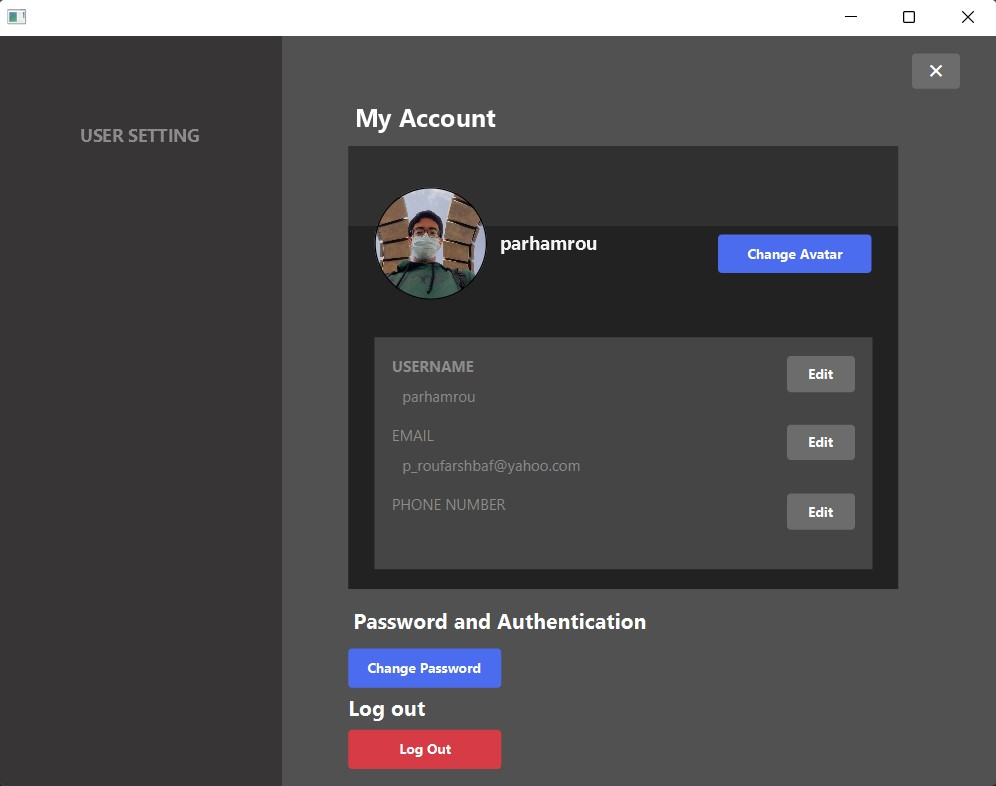
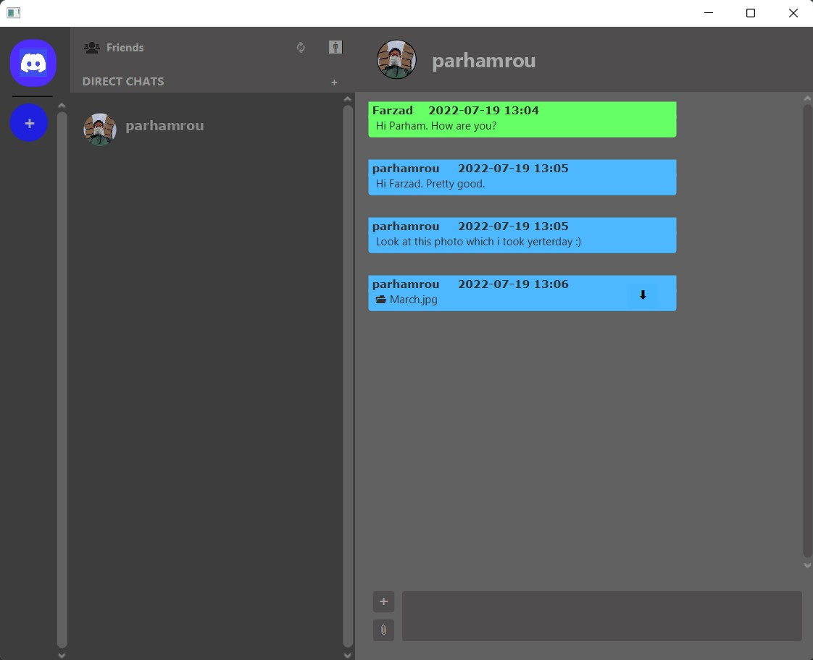

# JDiscord
This is my final project for the AP (Advanced Programming) course. In this project, we had to implement a simple version of the famous social media 
app 'Discord' using the java 16, JavaFX and sceneBuilder.
# Description
In this app you can send friendship requests to which user you want, create direct chats and servers. In servers, you can Create different channels
and remove them.
In channels and direct messages, you can send text and file messages. In servers, you can create roles and map them 
to the users of the server, add and remove users, change the name of the server and remove the server.
You can change your account information and your avatar too.
# Technologies used
- Core-java
- JavaFX
- CSS
- SceneBuilder
# Installation
- Download and install JDK(Java Developement Kit).
- Clone the ripository.
- Change the path of the "data.DAT" file in "DataManager" class to the real path of this file in your system.
- Run "MainServer.java" in Server package.
- Run "App.java" in app package.
- At the end, Press enter in the console environment of "MainServer" to save the data in the file.
# Images

